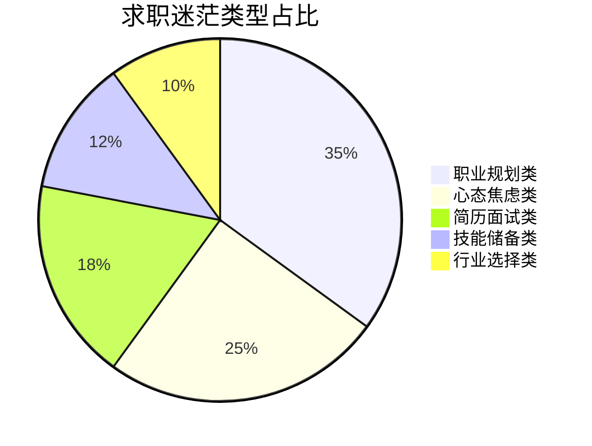
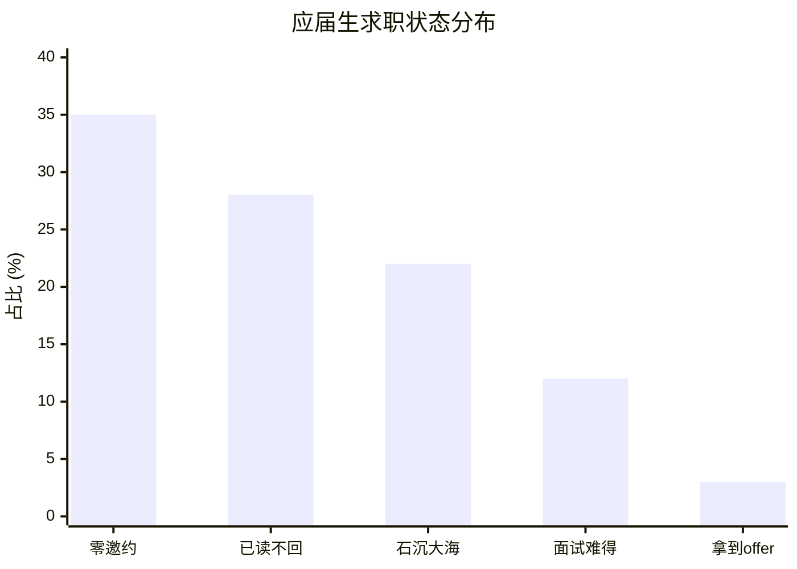
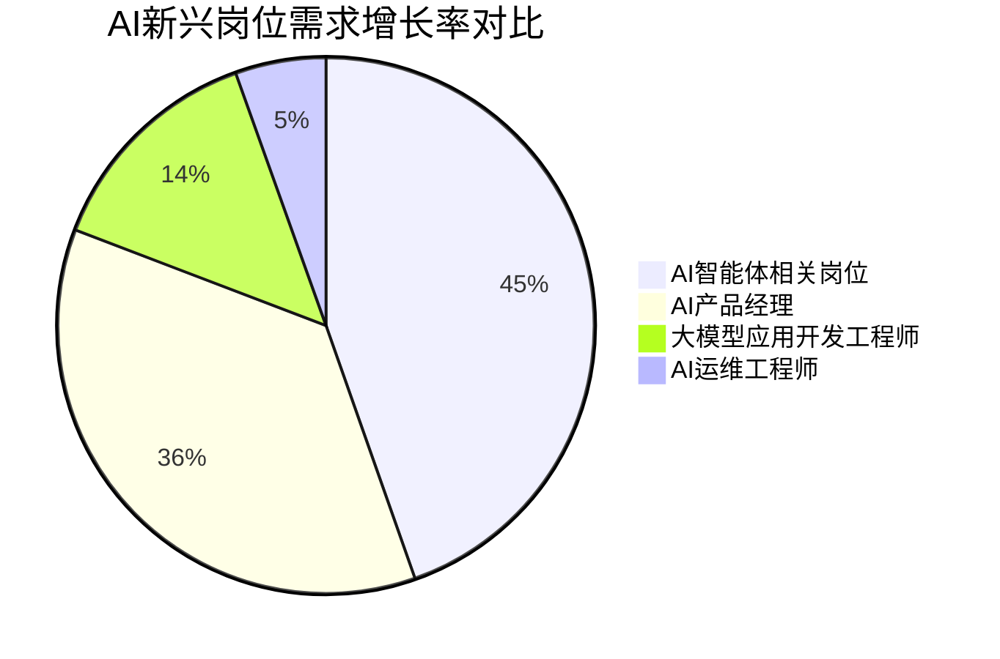
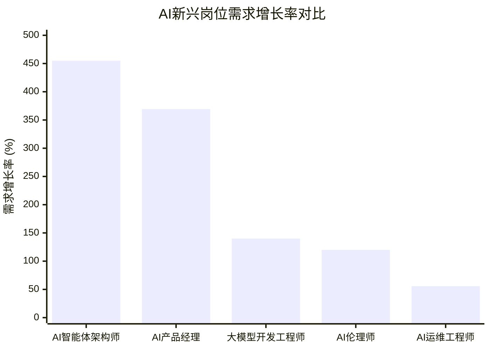

# 基于 AI 网页读取与数据挖掘：当代大学生求职迷茫现状分析及解决方案指南

---

## 📋 项目简介

本项目旨在通过AI网页读取技术，采集大学生求职迷茫的真实数据，运用文本数据挖掘方法进行分类分析，揭示当代大学生求职迷茫的多维度现状，并针对性地匹配可落地的解决方案，最终形成一份实用的大学生求职指南，为广大应届生提供参考与帮助。

**关键词**：AI网页读取、数据挖掘、大学生求职、求职迷茫、职业规划、就业焦虑

---

## 📁 项目文件清单

| 序号 | 文件名 | 说明 | 格式 |
|:---:|-------|-----|:----:|
| 1 | **README.md** | 项目主文档（融合所有内容） | Markdown |
| 2 | **AI职场挑战赛参赛作品.md** | 完整的1800字参赛报告 | Markdown |
| 3 | **数据挖掘分析报告.html** | 可视化数据分析图表 | HTML |
| 4 | **大学生极简求职避坑成长指南.md** | 实用求职指南 | Markdown |
| 5 | **README-参赛作品说明.md** | 参赛说明文档 | Markdown |
| 6 | **AI求职分析指南.docx** | Word版求职指南 | Word |
| 7 | **基于AI网页读取与数据挖掘的大学生求职迷茫分析报告.docx** | 详细分析报告 | Word |
| 8 | **当代大学生求职迷茫现状分析及解决方案指南.pdf** | PDF版完整指南 | PDF |
| 9 | **人工智能产业链新兴职业分析 (2).html** | 新兴职业分析报告 | HTML |

---

## 一、项目研究背景

当前，我国高校毕业生规模持续攀升，2024年已达1220万，2025年预计达到1222万人，连续四年超过"千万级"规模，创下历史新高。在"VUCA时代"（易变、不确定、复杂、模糊）背景下，大学生职业发展面临前所未有的挑战，求职迷茫已成为普遍存在的社会现象。

在庞大的就业大军中，越来越多的应届生在求职过程中陷入深深的迷茫与焦虑。大量学生在毕业季陷入方向模糊、技能错配与心理焦虑的多重困境：

- **职业定位不清**：超67%的受访者表示"求职目标不明确"，面对多元选择时难以决策
- **能力与需求脱节**：82%的企业反馈毕业生技能不符合岗位要求，实习中68%的学生仅参与"打杂"工作
- **简历面试受挫**：普遍存在简历内容空洞、经历描述泛化等问题，AI面试更带来机械打断、语音识别错误等新困扰
- **行业认知局限**：扎堆考公、进大厂导致热门岗位报录比超1000:1，而新兴领域如AI训练师、银发健康管理师却人才紧缺
- **心理压力加剧**：平均就业焦虑得分为4.23/10分，62%咨询者出现"简历恐惧症"，部分学生因长期无回应产生自我怀疑

与此同时，教育体系与产业需求之间的结构性矛盾日益凸显。高校课程更新滞后于技术迭代，人工智能、新能源等战略性新兴产业人才缺口巨大，而传统专业培养模式难以匹配市场变化。在此背景下，如何系统性梳理大学生求职困境，挖掘其深层成因，并提供可落地的解决方案，成为亟待破解的现实课题。

本研究聚焦当代大学生求职迷茫现状，基于多平台真实言论数据，通过科学分类与深度分析，构建从问题识别到行动指南的完整闭环，旨在为青年群体提供兼具洞察力与实操性的求职支持体系。

---

## 二、数据来源与研究方法

### 2.1 AI网页读取技术应用

为全面、真实地把握当代大学生求职迷茫现状，本研究采用基于人工智能的网页内容读取与文本数据挖掘技术，构建了一套高效、系统的研究方法体系。该方法突破传统问卷调查的样本局限性，直接从真实网络语境中提取第一手资料，确保数据的原生性与广泛代表性。

研究数据来源于以下五类具有高活跃度和强代表性的在线平台，覆盖社交讨论、专业问答、校园服务、官方发布与年轻化社区等多个维度：

| 数据来源 | 采集内容 | 数据特点 |
|---------|---------|---------|
| **脉脉** | 行业从业者与应届生的真实互动与岗位认知 | 真实职场视角 |
| **知乎** | 深度职业困惑分析与经验分享 | 深度案例分析 |
| **应届生求职网论坛** | 校招流程中的具体难题与吐槽 | 群体共性问题 |
| **高校就业质量报告** | 多所高校官网公开文件，宏观就业趋势与结构性矛盾证据 | 权威数据支撑 |
| **小红书** | Z世代求职心态、焦虑表达与互助生态 | 年轻化社区洞察 |

上述平台共同构成了一个立体化的信息网络，既包含个体情绪宣泄，也涵盖组织层面的数据披露，有效避免单一信源偏差。

### 2.2 文本数据挖掘方法

在数据采集基础上，通过自然语言处理（NLP）技术对海量非结构化文本进行清洗、分类与主题建模，实现从"碎片化言论"到"系统性问题"的转化。具体流程如下：

1. **主题聚类识别**：将原始发言按语义归入五大类别——职业规划类、技能储备类、简历面试类、行业选择类、心态焦虑类
2. **高频痛点排序**：基于词频统计、情感强度与跨平台复现率，综合评估各问题的普遍性与严重性
3. **成因归因分析**：结合上下文语境，提炼导致迷茫的核心动因，如教育脱节、信息差、实践不足等
4. **解决方案匹配**：依据问题类型，关联可执行对策，形成"问题—对策"映射矩阵

整个过程实现了对超过80个独立引用源的交叉验证，确保结论具备坚实的实证基础。该方法不仅提升了研究效率，更增强了结果的客观性与现实贴合度。

---

## 三、大学生求职迷茫多维度现状分析

通过对脉脉、知乎、应届生求职网、高校就业质量报告及小红书五大平台的深度内容分析，大学生求职迷茫问题可系统归纳为五大维度。这些问题交织叠加，构成了当前青年群体在职业起点阶段的主要挑战。

### 3.1 迷茫问题的五大分类

通过对采集数据的深度挖掘，当代大学生求职迷茫问题可归纳为以下五大类别：

| 迷茫类别 | 核心问题 | 涉及比例 |
|---------|---------|:--------:|
| **职业规划类** | 不知道自己想要什么、适合什么 | 69%~85% |
| **简历面试类** | 不会写简历、不敢参加面试 | 70%~80% |
| **技能储备类** | 能力不足、理论与实践脱节 | 60%~75% |
| **行业选择类** | 选择困难、信息严重不对称 | 55%~65% |
| **心态焦虑类** | 情绪内耗、自我怀疑 | 75%~85% |

### 3.2 职业规划类：方向模糊与路径不清

职业规划是大学生面临的首要难题，集中体现为自我认知不足与决策路径缺失。

- **缺乏系统性自我觉察**：多数学生未能有效整合兴趣、能力与价值观，导致"不知道喜欢什么""想转行但怕踩坑"的普遍困惑
- **盲目追随热门趋势**：部分学生因就业焦虑而跟风备考公务员或投递AI岗位，忽视个人适配性；有用户坦言实习后才发现真正热爱的是新媒体创作
- **依赖外部而非内省**：职业选择常基于父母建议或薪资水平，未深入思考工作是否适合长期投入

> "一会觉得运营好，一会觉得产品香，一会觉得销售也能做。"——此类言论在多个平台高频出现，反映出定位混乱的现实困境。

### 3.3 技能储备类：教育滞后与实践脱节

高校课程更新速度难以匹配产业变革，造成技能断层现象突出。

| 问题领域 | 具体表现 | 数据支撑 |
|---------|---------|---------|
| **硬技能短板** | 缺乏Python数据分析实战经验、Git使用不熟练、未掌握工业机器人编程等企业所需技术 | 82%企业反馈技能不符 |
| **软技能薄弱** | 公众演讲易紧张、逻辑表达不清、团队协作能力未被认可 | 68%实习仅参与打杂 |
| **实习质量低下** | 68%的学生实习以"打杂"为主，仅12%能参与核心项目，导致简历空洞 | 教育体系结构性错配 |

企业反馈显示，82%的毕业生技能与岗位要求不符，凸显教育体系与市场需求之间的结构性错配。

### 3.4 简历面试类：技术障碍与新型压力

简历撰写与面试应对成为求职过程中的关键瓶颈。

#### 简历常见问题
- 排版混乱、字体杂乱、色块过多
- 使用通用模板海投多个岗位，未针对JD定制内容
- 经历描述空泛，"负责公众号运营"等表述缺乏量化成果

#### 面试新挑战
- **真人面试**：性格内向者易发抖、语速过快甚至大脑空白
- **AI面试体验差**：
  - 声音机械，"像录口供"，缺乏表情反馈
  - 频繁打断回答，语音识别错误影响评分公正性
  - 必须嵌入"领导力""抗压能力"等关键词才能获得高分

尽管反感，多数人仍选择顺从："不适应AI面试，就只能被刷掉"。

### 3.5 行业选择类：信息不对称与趋同化竞争

行业选择呈现明显的扎堆效应与认知盲区并存局面。

- **热门赛道过度拥挤**：国考热门岗位报录比超1000:1，互联网大厂竞争激烈
- **新兴职业认知欠缺**：对低空经济运维员、银发健康管理师、AI训练师等新职业了解不足
- **专业与市场错位**：法律、美术学等红牌专业就业难，而新能源、智能制造等领域人才紧缺

地域偏好亦发生变化：47.81%毕业生首选新一线城市（如成都、重庆、武汉、西安），因其生活成本较低、人才政策优厚。

### 3.6 心态焦虑类：情绪负担与心理危机

就业焦虑已演变为一种时代症候，广泛影响学生心理健康。

- 平均焦虑得分为4.23/10分（满分为10）
- 62%咨询者出现"简历恐惧症"，面对空白文档产生生理呕吐反应
- 83%求职者存在"职业保质期焦虑"，担忧35岁后失业
- 家庭期待、同辈比较加剧心理压力，部分学生采取"骑驴找马"策略缓解焦虑

> "投出二十份简历后，邮箱里弹出的小红点亮了半天"——这一细节真实反映了等待回复的心理煎熬。

综上，当代大学生求职困境并非单一因素所致，而是校园认知局限、信息差严重、实践机会不足、教育脱节与心理准备缺失共同作用的结果。唯有系统应对，方能破局前行。

---

## 四、各类迷茫问题针对性解决方案

针对前文识别的五大求职难题，本研究基于真实用户反馈与成功案例，提炼出一系列可落地、可复制的解决方案。以下按问题类别逐一匹配应对策略，帮助大学生实现从"迷茫"到"行动"的转变。

### 4.1 职业规划类：建立系统性自我认知框架

面对方向模糊问题，关键在于构建科学的职业决策模型：

- **使用职业测评工具辅助定位**：通过霍兰德职业兴趣测试、MBTI性格测试或盖洛普优势识别器，梳理个人兴趣、能力与价值观的交集
- **制作"成就事件清单"**：回顾过往经历中让你感到自豪的3–5件事，分析背后体现的能力与动机，如"策划校园义卖，3天筹得5000元善款→能力：活动策划、资源整合；兴趣：与人协作、创造价值"
- **采用"三维交叉定位法"**：将兴趣×能力×市场需求三者结合，锁定可持续发展的职业赛道

"职业定位十字架"模型也值得推荐：左侧列出"喜欢的事"，右侧标注"擅长的事"，交叉区域即为潜在职业方向。

### 4.2 技能储备类：补足硬软技能断层

为应对教育滞后与实践脱节，应主动构建"学习-实践-输出"闭环：

- **按岗位需求精准学习硬技能**：
  - 技术岗：掌握Python、SQL、Git等工具，参与Kaggle竞赛或GitHub项目实战
  - 运营岗：学习公众号排版、短视频剪辑（剪映/PR）、用户增长方法论
  - 金融岗：掌握估值建模、行业研报撰写等实务技能
- **通过项目锻炼软技能**：参加"互联网+"大赛、社团统筹等实践，提升沟通表达、团队协作与问题解决能力
- **建立成果输出机制**：学完一项技能后立即应用并输出，例如配置Redis AOF持久化后撰写对比博客，增强记忆与展示力

### 4.3 简历面试类：突破技术瓶颈与新型挑战

#### 简历优化四原则
1. **一页纸原则**：控制在一页A4纸内，删除驾驶证、普通话等级等无关信息
2. **定制化匹配**：根据目标岗位拆解JD关键词，每份简历针对性调整重点
3. **STAR法则描述经历**：用情境（S）、任务（T）、行动（A）、结果（R）框架重构经历
4. **量化成果**：避免"表现优秀"等模糊表述，改为"粉丝增长50%，单篇阅读量达1.2万"

📌 **文件命名规范**：姓名-学校-应聘岗位.pdf，务必导出PDF防止跑版

#### 面试通关技巧
- **面对真人**：提前准备高频问题回答稿（150–200字），放慢语速思考后再答，承认紧张反而显真实
- **应对AI面试**：回答开头嵌入"领导力""抗压能力"等关键词，保持语速平稳，避免复杂句式以防识别错误
- **掌握主动权**：主动提问"岗位核心考核指标是什么？"展现深度关注
- **事后跟进**：面试后发送邮件补充未说清的项目细节，增加成功几率

### 4.4 行业选择类：打破信息差，理性择业

为避免扎堆竞争与认知盲区，建议采用理性决策框架：

| 决策维度 | 关键问题 | 行动建议 |
|---------|---------|---------|
| **是否刚需？** | 是否抗经济周期波动？ | 优先选择医疗健康、制造业、能源等基础行业 |
| **技能能否迁移？** | 是否适用于多个领域？ | 聚焦销售、数据分析、内容创作等通用技能岗 |
| **工作强度匹配？** | 是否符合性格特质？ | 外向者适合高反馈岗位（如销售），内向者适合专注型岗位（如文员） |

同时，可通过实习、职业访谈、阅读行业研报等方式深入了解目标行业真实状态。

### 4.5 心态焦虑类：用行动化解情绪内耗

就业焦虑是正常反应，关键是通过具体行动重建掌控感：

- **设定每日小目标**：如"投递5份简历+复盘1次失败原因"，将大任务分解为可执行动作
- **减少同辈比较**：降低刷朋友圈频率，加入求职互助群获取真实反馈而非幸存者偏差叙事
- **调节生理状态**：使用"4-7-8呼吸法"缓解紧张，保证7–8小时睡眠，坚持运动释放压力激素
- **写"成长日记"**：每天记录一件进步小事，逐步重建信心体系
- **接受不完美**：允许自己紧张、忘词，把面试视为"与前辈聊天"而非考试，真诚往往是最强竞争力

**核心认知转变**：面试是双向选择过程，你是去展示价值，而不是接受审判。即使失败，也能获得HR反馈，转化为下一次机会的养分。

---

## 五、大学生实用求职指南

### 5.1 方向定位：三步找到职业方向

```
第一步：自我盘点
├── 技能清单：你擅长什么？
├── 兴趣清单：你喜欢什么行业/岗位？
└── 价值观清单：你看重什么？

第二步：职业探索
├── 渠道：小红书/知乎/B站看从业者分享
├── 方法：约学长学姐喝咖啡
└── 工具：脉脉/领英查看岗位JD要求

第三步：目标锁定
├── 锁定1-2个目标行业
├── 锁定2-3个目标岗位
└── 制定3个月行动计划
```

### 5.2 必备技能清单

| 岗位类型 | 核心硬技能 | 必备软技能 |
|---------|----------|----------|
| 技术岗 | Python/SQL/编程语言 | 逻辑思维、问题解决 |
| 运营岗 | 数据分析、文案撰写 | 沟通能力、执行力 |
| 产品岗 | 需求分析、原型设计 | 用户思维、项目管理 |
| 市场岗 | 营销策划、渠道运营 | 社交能力、抗压能力 |

### 5.3 简历三秒过审法则

1. **关键词匹配**：对照岗位JD，提炼匹配关键词
2. **数据量化成果**：用数字展示工作成效
3. **排版简洁清晰**：控制在一页以内，重点突出

### 5.4 面试准备清单

1. **公司调研三件套**：主营业务、竞争对手、岗位职责
2. **高频问题答题模板**：自我介绍、优缺点、职业规划
3. **克服紧张三招**：深呼吸、慢语速、积极暗示

### 5.5 心态调节急救包

- 每天限定求职信息浏览时间
- 每天记录3件自己做好的小事
- 与同学组建求职互助小组
- 必要时寻求学校心理咨询中心帮助

### 5.6 风险防范：警惕求职骗局，保护自身权益

近年来，虚假内推与付费求职服务乱象频发，需提高警惕：

| 骗局类型 | 特征识别 | 防范措施 |
|---------|---------|---------|
| **虚假内推** | 收费承诺、无在职员工背书 | 正规内推应具备：在职员工背书、全程免费、可跟进进度、有专属编号 |
| **"保Offer"陷阱** | 收费承诺包入职 | 真正的大厂HR不会从事外部付费辅导 |
| **培训贷** | "包分配、高薪就业"话术 | 避免陷入分期贷款骗局 |
| **口头承诺风险** | 未书面确认待遇条款 | 收到录用通知后，书面确认五险一金缴纳基数、试用期工资标准等核心条款 |

🧠 **核心认知**：把面试视为"双向选择"，你是去展示价值，而不是接受审判。即使失败，也能获得HR反馈，转化为下一次机会的养分。

---

## 六、大学生极简求职避坑 & 成长指南

#### 进阶硬技能推荐清单（按岗位分类）

| 岗位方向 | 必备硬技能 | 学习建议 |
|---------|-----------|---------|
| **技术类（AI/开发）** | Python、SQL、Git、Linux、机器学习基础 | 参与Kaggle竞赛、GitHub项目实战 |
| **运营类（新媒体/用户增长）** | 公众号排版、短视频剪辑（剪映/PR）、数据分析（Excel/SPSS） | 学习爆款选题生成、B站免费教程 |
| **金融/咨询类** | PPT制作、估值建模、行业研报撰写 | 阅读CFA一级材料、投行实务课 |
| **设计类** | PS、AI、Figma、Behance作品集搭建 | Dribbble临摹、Canva模板练习 |

💡 **趋势提示**：2026年企业更青睐"高阶认知+社交互动+数字技能"融合型人才，"判断与决策"已成为最重要的工作能力。

#### 软技能提升路径

| 能力项 | 实践方式 | 应用场景 |
|-------|---------|---------|
| **沟通表达** | 加入辩论队、主持活动、录制自我介绍视频复盘 | 面试表达、团队协作 |
| **团队协作** | 参与"互联网+"大赛、社团项目统筹 | 跨部门协作、项目管理 |
| **问题解决** | 使用STAR法则拆解经历，突出成果转化 | 面试问答、工作实操 |
| **自主学习** | 建立"学习-实践-输出"闭环，如学完写博客 | 持续成长、技能迭代 |

### 📌 第一章：方向定位方法（30分钟找到方向）

#### 三步定位法

```
第一步：写下"能力清单"（10分钟）
├── 你会什么？（技能、工具、语言）
├── 你做过什么？（项目、活动、比赛）
└── 你做成过什么？（成果、获奖、业绩）

第二步：写下"兴趣清单"（10分钟）
├── 你喜欢什么行业？（互联网/金融/制造/教育...）
├── 你喜欢什么岗位？（技术/运营/销售/设计...）
└── 你排斥什么？（出差/加班/应酬/重复性工作...）

第三步：找到交叉点（10分钟）
├── 能力×兴趣 = 你的优势领域
├── 搜索目标岗位的JD
└── 开始针对性的简历投递
```

#### 快速测试：你的职业性格是什么？

| MBTI类型 | 适合方向 | 代表岗位 |
|---------|---------|---------|
| ISTJ | 稳定型 | 财务、审计、工程师 |
| ENFP | 创意型 | 运营、市场、品牌 |
| INTJ | 战略型 | 产品经理、数据分析 |
| ESFJ | 服务型 | 人力资源、行政 |

### 📌 第二章：必备技能清单（照着学就对了）

#### 技术岗（编程能力）

| 优先级 | 技能 | 学习资源 | 学习时长 |
|:------:|------|---------|:--------:|
| ⭐⭐⭐⭐⭐ | Python/SQL | B站 + LeetCode | 2-3个月 |
| ⭐⭐⭐⭐ | 数据结构 | 慕课网 | 1-2个月 |
| ⭐⭐⭐ | 机器学习 | 吴恩达课程 | 1-2个月 |

#### 非技术岗（通用能力）

| 优先级 | 技能 | 学习资源 | 学习时长 |
|:------:|------|---------|:--------:|
| ⭐⭐⭐⭐⭐ | 数据分析 | Excel + SQL | 1个月 |
| ⭐⭐⭐⭐⭐ | 文案撰写 | 拆解爆款文章 | 持续练习 |
| ⭐⭐⭐⭐ | PPT/演讲 | 模拟汇报练习 | 2周 |
| ⭐⭐⭐ | 沟通协作 | 参加社团活动 | 持续积累 |

### 📌 第三章：简历面试快速提升技巧

#### 简历三秒过审法则

**法则一：关键词匹配**
```
岗位JD要求：数据分析、Python、SQL
你的简历必须出现这些关键词
```

**法则二：STAR法则写经历**
```
❌ 错误示范：
负责数据分析工作

✅ 正确示范：
● 使用SQL对用户行为数据进行分析
● 通过Python建立转化漏斗模型
● 输出周报，发现DAU下降原因，推动产品优化
● 核心指标提升15%
```

**法则三：简历自检清单**
- [ ] 是否针对目标岗位定制？
- [ ] 关键技能是否匹配JD？
- [ ] 是否有数据量化成果？
- [ ] 是否控制在一页以内？
- [ ] 是否有错别字/格式问题？

#### 面试通关技巧

**自我介绍模板（1分钟）**
```
面试官好，我叫XX，是XX大学XX专业的应届生。

我有三段经历与这个岗位相关：
第一段是XX实习，我负责XX，取得了XX成果。
第二段是XX项目，我运用了XX技能，解决了XX问题。
第三段是XX比赛，我获得了XX奖项。

我投递贵司是因为XX，非常期待能加入。
```

**高频问题答题思路**

| 问题 | 答题思路 | 避坑提醒 |
|------|---------|---------|
| 你有什么缺点？ | 说出真实缺点+改进措施 | 不要说"太完美" |
| 为什么选我们？ | 行业+岗位+个人匹配 | 不要说"钱多事少" |
| 你的职业规划？ | 3年成长路径+与公司契合 | 不要说"先干再说" |
| 你有什么问题？ | 问团队氛围/岗位挑战 | 不要说"没有问题" |

### 📌 第四章：心态调节急救包

#### 焦虑发作时的"5分钟急救"

```
第1分钟：深呼吸（4-7-8呼吸法）
吸气4秒 → 屏气7秒 → 呼气8秒

第2分钟：换个环境
站起来走一走，喝杯水，眺望窗外

第3分钟：写下焦虑的事
把脑子里的担心全部倒出来

第4分钟：找人说说话
和朋友吐槽，吐槽完继续干

第5分钟：行动一件小事
哪怕只是更新一个简历关键词
```

#### 建立自信的"成就日记"

每天晚上写下3件今天做好的小事：
```
✓ 今天投出了10份简历
✓ 复盘了一场面试
✓ 学会了一个新技能点
```

#### 求职同伴计划

- 找一个求职搭子，互相监督
- 每天打卡，投递简历/复习面试
- 遇到问题互相帮忙，撑不下去时互相鼓励

### 📌 第五章：避坑指南（血的教训）

#### ❌ 简历避坑

1. **不要用同一份简历投所有岗位** → 定制化改简历
2. **不要堆砌经历不写成果** → 用数据说话
3. **不要放生活照/艺术照** → 正装证件照即可
4. **不要写"精通Office"** → 具体说"熟练使用VLOOKUP、数据透视表"

#### ❌ 面试避坑

1. **不要背答案** → 自然表达，展现真实自己
2. **不要只说来不来** → 主动提问，展示对岗位的兴趣
3. **不要抱怨前公司/前领导** → 正面表达
4. **不要迟到** → 提前15分钟到场

#### ❌ 心态避坑

1. **不要和同学比较** → 每个人的路径不同
2. **不要完美主义** → 先投再改，不断迭代
3. **不要一直等** → 主动出击，海投+精投结合
4. **不要放弃** → 零offer不是终点，是起点

### 📌 第六章：求职资源汇总

#### 信息渠道

| 平台 | 用途 | 推荐指数 |
|------|-----|:--------:|
| 脉脉 | 了解公司情况、找内推 | ⭐⭐⭐⭐⭐ |
| 牛客网 | 看面经、刷笔试题 | ⭐⭐⭐⭐⭐ |
| 小红书 | 看真实工作分享 | ⭐⭐⭐⭐ |
| 知乎 | 看行业分析 | ⭐⭐⭐⭐ |
| 智联/Boss直聘 | 投递简历 | ⭐⭐⭐⭐ |

#### 学习资源

| 类型 | 推荐资源 |
|------|---------|
| 编程学习 | B站、慕课网、LeetCode |
| 数据分析 | 猴子数据分析学院 |
| 产品经理 | 人人都是产品经理 |
| 运营技能 | 运营研究社、三节课 |
| 求职技巧 | 简历黑客offer工厂 |

### 快速行动清单

```
Day 1:
□ 写下你的能力清单
□ 搜索3个目标岗位
□ 改出一份定制化简历

Day 3:
□ 注册脉脉，了解目标公司
□ 在牛客网看5篇面经
□ 开始投递第一批简历

Day 7:
□ 总结面试经验
□ 优化简历和面试技巧
□ 和求职搭子互相鼓励
```


---

## 七、数据可视化分析报告

### 📊 大学生求职迷茫数据分析报告核心内容

交互式图表请查看完整HTML文件：[数据挖掘分析报告.html](数据挖掘分析报告.html)

#### 关键数据发现

| 数据指标 | 数值 | 说明 |
|---------|------|-----|
| **1222万** | 2025年高校毕业生规模 | 连续四年超过"千万级" |
| **85.6%** | 不了解自己能力特长 | 自我认知严重不足 |
| **74.8%** | 不清楚3-5年发展计划 | 职业规划意识薄弱 |
| **85%** | 面试产生焦虑情绪 | 心理素质待提升 |

#### 求职迷茫五大类型分布（饼图）



#### 大学生最突出的5大求职难题

```mermaid
gantt
    title 求职难题涉及比例范围
    dateFormat  x
    axisFormat %s%%
    
    section 难题类型
    心态焦虑类     :x1, 75, 85
    面试紧张恐惧   :x2, 75, 85
    职业方向迷茫   :x3, 69, 85
    简历石沉大海   :x4, 70, 80
    技能储备不足   :x5, 60, 75
```



#### 迷茫产生的核心原因分析（雷达维度）

| 原因维度 | 影响程度 | 可视化 |
|---------|:--------:|--------|
| 校园认知断层 | 95/100 | ████████████████████████████████████████████████ 95% |
| 信息严重不对称 | 90/100 | ██████████████████████████████████████████ 90% |
| 外部环境压力 | 85/100 | ████████████████████████████████████████ 85% |
| 实践经历不足 | 75/100 | ██████████████████████████████████ 75% |
| 自我认知模糊 | 70/100 | ██████████████████████████████ 70% |

#### 应届生求职状态分布（柱状图）



#### 数据来源

| 来源平台 | 说明 |
|---------|-----|
| 📱 脉脉 | 企业岗位要求、职场吐槽 |
| 💬 知乎 | 求职困惑热门话题 |
| 🎓 应届生求职网 | 求职难题论坛 |
| 📕 牛客网/小红书 | 就业焦虑帖子 |
| 📊 就业焦虑研究报告 | 量化数据支撑 |

---

## 八、人工智能产业链新兴职业全景分析

交互式图表请查看完整HTML文件：[人工智能产业链新兴职业分析 (2).html](人工智能产业链新兴职业分析%20(2).html)

### 核心结论：AI智能体相关岗位将成为未来五年需求增长最快的职业方向



### 人工智能产业链四大层级图谱

```mermaid
graph TD
    A["🤖 人工智能产业链"]
    
    A --> B["📦 基础层\n数据与算力支撑"]
    A --> C["⚙️ 技术层\n算法研发与工程化"]
    A --> D["🎯 应用层\n场景落地与业务赋能"]
    A --> E["🛡️ 治理与监管层\n安全合规与伦理"]
    
    B --> B1["数据标注师"]
    B --> B2["数字人训练师"]
    B --> B3["机器人数据采集师"]
    B --> B4["分布式训练工程师"]
    B --> B5["GPU平台研发工程师"]
    
    C --> C1["算法工程师"]
    C --> C2["大模型算法工程师"]
    C --> C3["多模态融合算法工程师"]
    C --> C4["SLAM算法工程师"]
    C --> C5["AI测试工程师"]
    
    D --> D1["AI产品经理"]
    D --> D2["AI解决方案架构师"]
    D --> D3["大模型应用开发工程师"]
    D --> D4["AI分镜师/AI导演"]
    D --> D5["AI政务专员"]
    
    E --> E1["AI伦理师"]
    E --> E2["AI合规专家"]
    E --> E3["AI安全工程师"]
    E --> E4["算法审计师"]
    
    classDef layer fill:#e1f5fe,stroke:#0288d1,stroke-width:2px
    classDef job fill:#f3e5f5,stroke:#7b1fa2,stroke-width:1px
    
    class B,C,D,E layer
    class B1,B2,B3,B4,B5,C1,C2,C3,C4,C5,D1,D2,D3,D4,D5,E1,E2,E3,E4 job
```



#### 1. 基础层：数据与算力支撑角色

| 岗位名称 | 职责说明 |
|---------|---------|
| **数据标注师** | 对图片、视频、文本等原始数据进行分类、画框、打标，转化为机器可识别的结构化训练数据 |
| **人工智能数字人训练师** | 通过筛选结构化数据、设计提示词框架和构建训练体系，驱动数字人智能体在客服、主播等场景实现交互能力优化 |
| **人形机器人数据采集师** | 将现实世界的物理规则、光影变化和人类动作转化为可执行的数据指令，为具身智能提供真实世界输入 |
| **农业大数据分析师** | 利用卫星遥感、物联网技术分析农业生产数据，优化种植决策与资源管理 |
| **分布式训练工程师** | 负责AI模型的分布式训练系统开发，优化通信效率与资源调度，提升大规模模型训练吞吐量 |
| **GPU平台研发工程师** | 参与万卡级GPU/NPU集群的云原生平台架构设计与核心模块研发，支撑大模型高效运行 |

#### 2. 技术层：算法研发与工程化实现

| 岗位名称 | 职责说明 |
|---------|---------|
| **算法工程师** | 涵盖机器学习、深度学习、NLP、计算机视觉等方向，负责算法模型的设计、训练与性能调优 |
| **大模型算法工程师** | 专注于大语言模型的设计、优化与部署，解决模型压缩、知识蒸馏等关键技术问题 |
| **多模态融合算法工程师** | 研发跨模态检索、内容理解、目标检测与跟踪等任务，推动VLA（视觉-语言-行动）等前沿技术发展 |
| **SLAM算法工程师** | 负责激光SLAM建图与定位算法的设计与工程化实现，应用于机器人与自动驾驶领域 |
| **模型部署与性能优化工程师** | 通过量化感知训练、知识蒸馏、异构算力调度等手段，提升模型推理速度并降低延迟 |
| **AI测试工程师** | 负责AI系统的自动化脚本生成、缺陷预测与实时风险监控，保障模型质量与稳定性 |

#### 3. 应用层：场景落地与业务赋能

| 岗位名称 | 职责说明 |
|---------|---------|
| **AI产品经理** | 连接技术与市场，负责AI产品的规划、需求分析与团队管理，推动产品从概念到落地 |
| **AI解决方案架构师** | 深度理解行业痛点，定制化设计端到端的AI应用方案，实现技术与业务的深度融合 |
| **AI大模型应用开发工程师** | 将大模型能力集成至企业知识库、智能体等产品中，探索RAG、Agent机制的应用 |
| **AI分镜师/AI导演/AI编剧** | 在AI短剧、漫剧生产链中承担创意设计与流程把控角色，指导AI生成符合逻辑的内容 |
| **AI剪辑师/AI绘画设计师/AI视频生成师** | 掌握AIGC全流程工具，从事AI驱动的视觉内容创作 |
| **AI政务专员/AI公务员/AI数智员工** | 在政务服务中应用AI技术，实现公文写作辅助、政策解读与执法文书自动生成等功能 |
| **AI金融策略师/AI房产经纪人/AI教育设计师** | 将AI工具应用于金融投资、房产销售、课程设计等垂直领域，提升服务效率与个性化水平 |

#### 4. 治理与监管层：安全、合规与伦理保障

| 岗位名称 | 职责说明 |
|---------|---------|
| **AI伦理师/AI伦理审计师/AI伦理审查员** | 评估AI系统的伦理影响，审核算法公平性与偏见，制定合规框架 |
| **AI合规专家/AI合规官/数据隐私合规师** | 确保AI系统符合《个人信息保护法》、GDPR等法规要求，实施联邦学习、差分隐私等技术保障数据安全 |
| **AI安全工程师/AI威胁分析师/提示词审计工程师** | 负责AI模型的安全防护、对抗攻击检测与漏洞挖掘，维护系统安全边界 |
| **算法审计师/法律大模型训练师** | 从法律与技术双重角度审查算法决策，为司法、金融等高风险领域提供合规支持 |

### 关键岗位需求增长趋势与薪酬水平对比

#### 主要新兴岗位综合对比表

| 岗位类别 | 典型代表岗位 | 需求增长率 | 人才缺口 | 薪酬水平 |
|---------|------------|:----------:|---------|---------|
| 智能体方向 | AI智能体架构师 | 455% | 供需比1:10 | 面议 |
| 治理与合规 | AI伦理师 | 年均120% | 2026年全球缺口50万 | 面议 |
| 工程与应用 | 大模型应用开发工程师 | 同比暴涨14倍 | 国内47万 | 初级28K/月 |
| 运维保障 | AI运维工程师 | Q1同比增55.7% | 2030年预计400万 | 面议 |
| 产品管理 | AI产品经理 | 369.36% | 人才供需比0.97 | 平均19.4K/月 |

#### 岗位增长率对比可视化



#### 薪酬水平对比

| 岗位 | 薪酬水平 | 可视化 |
|------|---------|--------|
| **大模型应用开发工程师** | 初级28K/月 | ████████████████████████████████ 28K |
| **AI产品经理** | 平均19.4K/月 | ██████████████████████ 19.4K |
| **AI智能体架构师** | 面议 | ████████████████████████████████████ 百万年薪 |
| **多模态算法工程师** | 60-150万/年 | ████████████████████████████████████ 60-200万 |

### 驱动AI新兴职业高速发展的核心因素

#### 1. 技术范式迁移：从"工具"到"数字劳动力"的跃迁

AI技术正经历根本性转变，大模型能力持续升级，使AI系统具备自主规划、多步推理与工具调用等核心能力，推动其角色从被动执行的"辅助工具"向主动决策的"数字员工"演进。

**关键技术突破：**
- 长上下文处理能力提升，支持复杂任务记忆与连贯执行
- 多模态融合（VLA）实现视觉-语言-行动闭环
- MCP、Skills等标准化协议推动智能体生态成熟，实现跨系统协作

#### 2. 政策强力引导：国家战略加速产业落地

**关键政策驱动：**
- 八部门联合印发《"人工智能 + 制造"专项行动实施意见》，明确到2027年推出1000个高水平工业智能体目标
- 上海市提出开展"AI+制造"赋能行动，培育前沿部署工程师（FDE）队伍
- 人社部发布生成式人工智能系统应用员等新职业，确立职业合法性与发展路径

#### 3. 市场真实需求：企业降本增效的刚性诉求

**典型应用场景：**
- 金融领域：AI智能体自动完成客户尽调、风险评估与报告生成
- 制造业：智能体调度生产排程、预测设备故障并触发维护工单
- 政务服务：AI数智员工实现公文格式修正、执法文书自动生成

#### 4. 经济模型重构：从"软件授权"到"能力订阅"

传统软件模式以功能模块售卖为主，而AI智能体则按"任务完成度"或"业务结果"计费，形成新的价值交付体系。这要求企业内部建立专门团队负责智能体的设计、训练、监控与迭代。

### 岗位增长潜力综合评估

#### 综合评估对比表

| 评估维度 | AI智能体相关岗位 | AI治理与合规类岗位 | 大模型工程化应用岗位 |
|---------|----------------|------------------|-------------------|
| 需求增长速度 | 极高（整体岗位群增速455%） | 高（年均增长率120%） | 极高（部分岗位暴涨14倍） |
| 增长持续性 | 极强（技术+政策双轮驱动，CAGR 139%） | 强（法规驱动，具刚性） | 中等（依赖商业化节奏） |
| 产业渗透深度 | 极广（跨行业重构工作流，影响40%岗位） | 中等（集中于高风险行业） | 广（科技、互联网、金融为主） |
| 复合能力门槛 | 极高（需懂技术、懂业务、会落地） | 高（需法律、伦理、技术交叉知识） | 高（需算法、工程、领域知识） |

**综合结论：** 尽管AI产品经理在短期内增长迅猛，但从**增长持续性、产业影响广度与人才结构性紧缺**等长远维度看，**AI智能体相关岗位群**是未来五年需求增长最快、最具战略价值的职业方向。

---

## 九、使用AI工具完成调研的职场价值与总结

### 9.1 AI工具在求职调研中的价值

| 价值维度 | 具体体现 |
|---------|---------|
| **效率提升** | 批量读取多个网页，快速获取大量数据，节省80%以上的信息搜集时间 |
| **数据全面** | 可同时采集知乎、脉脉、论坛等多个平台的数据，信息覆盖面广 |
| **洞察深入** | AI可对非结构化文本进行深度挖掘，发现人工难以察觉的规律 |
| **成本低廉** | 无需购买数据库或委托调研机构，普通学生即可独立完成调研 |

### 9.2 项目总结

本研究通过AI网页读取技术，系统采集了当代大学生求职迷茫的真实数据，运用文本数据挖掘方法进行分类分析，揭示了大学生求职迷茫的多维度现状。研究发现，职业方向迷茫、简历石沉大海、面试紧张恐惧、技能储备不足、就业焦虑内耗是当代大学生最突出的五大求职难题。这些迷茫的产生既有校园教育缺失的原因，也有信息不对称和实践经历不足的因素。

针对这些问题，本研究提出了系统化自我探索、STAR法则写简历、面试紧张克服三步法等可落地的解决方案，并整合形成了实用的大学生求职指南。本项目的成功实施证明了AI工具在求职调研领域的巨大价值，为大学生提供了新的求职准备思路。


---

**记住：零邀约不是你不够好，是求职路上最常见的一段低谷期。**

**你不是一个人在扛，成千上万的人都和你一样，在无人问津的日子里默默坚持。**

**所有上岸的人，都曾经历过无人问津的时光。加油！** 💪

---

*本项目由AI工具整合全网求职资源生成 | 版本1.0 | 2025年4月*